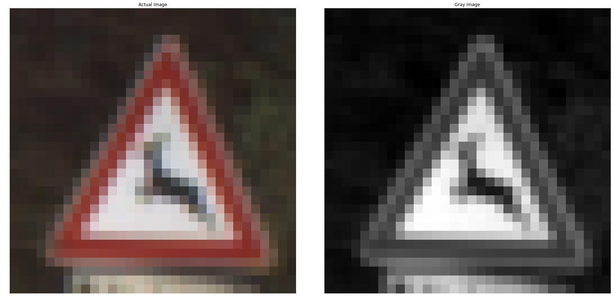

# Traffic_Sign_Classifier
This project identifies 43 different images of European of Traffic signals using CNN

## Objective:

1. To train the provided Traffic Signal images with 43 classes using Convolutional Neural Network (LeNet).
2. Add New images apart from the images provided in dataset and check the predictions.

## Solution:

## 1. Dataset Exploration:

**DataSet Summary::**

**Exploratory Visualization:**

_Train dataset Histogram_

_Validation dataset Histogram_

_Test dataset Histogram_

_Images from all labels_

## 2. Design and Test a Model Architecture

**a) Pre-processing:**

Convert Images from Colour to Gray:
Converting images from colour gray reduces the number of features in the dataset which makes training process easier. It also helps in training images which are too dark and contains little colour.

**b) Model Architecture:**

An **LeNet** based Convolutional Neural Network was build to train. Dropouts layers are added to reduce overfitting.

**c) Model Training**

To train the model an **Adam Optimizer** is used with the following parameters.

 - Batch Size : 80
 - Epochs : 200
 - Learning Rate : 0.001
 - Mean : Zero
 - Variance : 0.1

**d) Solution Approach**

 - Training Accuracy = 1.000
 - Validation Accuracy = 0.948
 - Test Accuracy = 0.940

## 3. Test a Model on New Images

**a) Acquiring New Images**

The following images are added as new images. The preceding numbers are the labels for the images. The size of the images is changed to 32x32 (28x28 with 2-pixel row padding).
The outer image shapes play a critical role in identifying the images. The round, triangle, rhombus and rectangle are different kind of outer shapes. Since there were more number of signs in each of such categories, during predictions it becomes tough to classify between multiple images.

1. NewImages/35_StraightAhead.jpg
2. NewImages/32_Endofallspeed.jpg
3. NewImages/26_TrafficSignals.jpg
4. NewImages/12_Priority.jpg
5. NewImages/17_NoEntry.jpg

**b) Performance on New Images**

The prediction accuracy is exactly 100% i.e. the model correctly guesses 5 out of 5 new traffic signs.

Prediction: [35 32 26 12 17]

Test Accuracy = 1.000

**c) Model Certainty - Softmax Probabilities**

